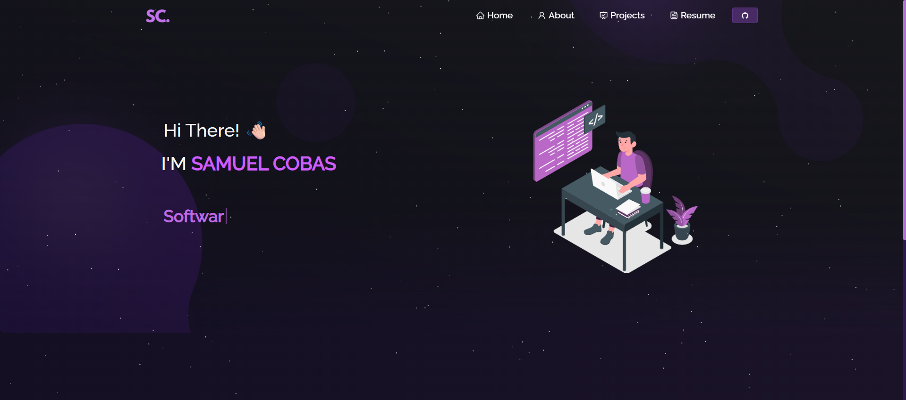

<h2 align="center">
  Portfolio 
  <a href="https://samuel-cobas-portfolio.vercel.app/" target="_blank">Samuel Cobas</a>
</h2>

 

<h3 align="center">
    🔹
    <a href="https://github.com/vlicus/Portfolio/issues">Report Bug</a> &nbsp; &nbsp;
    🔹
    <a href="https://github.com/vlicus/Portfolio/issues">Request Feature</a>
</h3>

## Built With

My personal portfolio <a href="https://samuel-cobas-portfolio.vercel.app/" target="_blank">Samuel Cobas</a> which features some of my github projects as well as my resume, technical skills and some more info about me!. 

This project was built using these technologies.

- React.js
- CSS3
- VsCode
- Vercel

## Features

**📖 Multi-Page Layout**

**🎨 Styled with React-Bootstrap and Css with easy to customize colors**

**📱 Fully Responsive**

## 🛠 Installation and Setup Instructions

1. Installation: `npm install` to install the needed dependencies 😄

2. In the project directory, run: `npm start` to launch the project! 🚀

Run the app in the development mode.\
Open [http://localhost:3000](http://localhost:3000) to view it in the browser.\
The page will reload if there is any modification in the code!.

## Usage Instructions

Open the project folder and Navigate to `/src/components/`.  
You will find all the components used and you can edit your information accordingly.

## Credit

Credit to [Soumyajit4419](https://github.com/soumyajit4419/Portfolio). Thanks!
